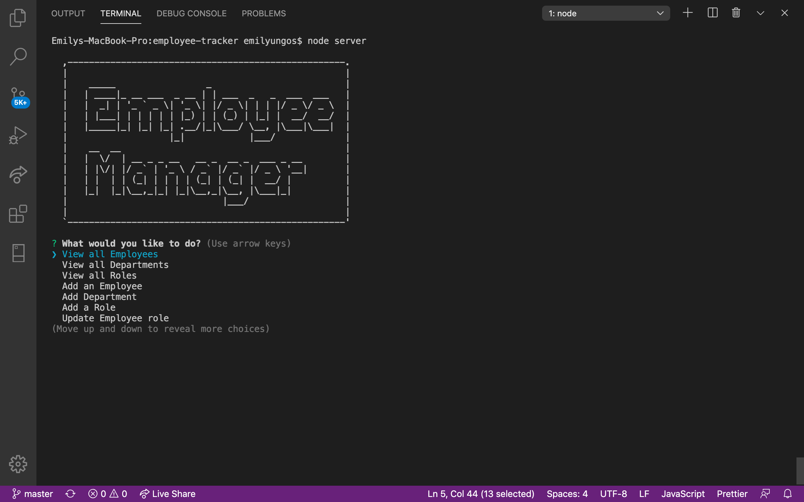

# Employee Tracker

## Description 

This is an employee tracker application that allows the user to add and view departments, roles and employees as well as update the role of a certain employee in the database using `mysql workbench` and `node.js`.  

## Link for the deployed application

* https://github.com/vlad916/employee-tracker

## Link for the Video (demo)

* https://drive.google.com/open?id=1Ckmcv-S2SGA-Q5kMWXULps5TZBapSA9M

## Technologies used in building the application

* Inquirer module
* Mysql module
* Mysql workbench / Sql database
* Node.js
* Console.Table module
* Asciiart-logo module

___

___
## Instructions on how to use the application

* Clone the repository

* Open `employee-Schema.sql` and `seed.sql` files in `Mysql workbench` and then run it. 

* Open the `server.js` file in visual studio or any code editor of your choice.

* Install all npm packages with `npm install`.

* Run the app with `node server.js` in the terminal to start the application.

* Choose any from the following onscreen prompts `( View, Add, Update, or Quit task )`. 

